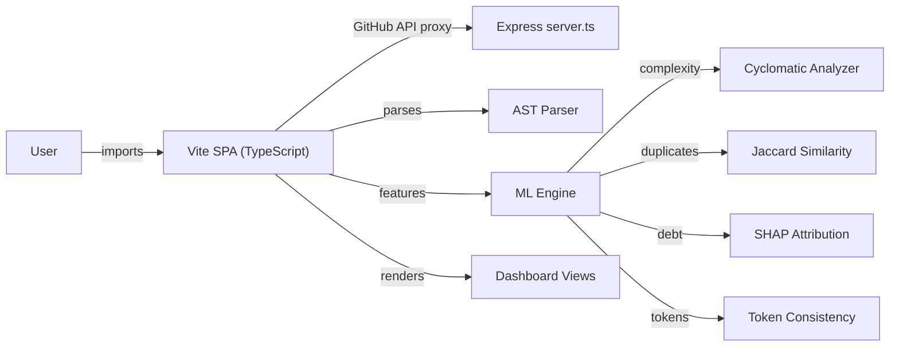
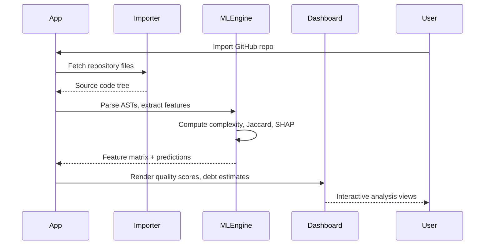

# DevLens

Client-side ML-powered code analysis platform. Computes cyclomatic complexity, detects duplicate components, evaluates design token consistency, and predicts technical debt costs — all in the browser with zero Python dependencies.

## Overview

Analyzes source code ASTs directly in the browser using a pure TypeScript ML engine. Supports GitHub repository import and local folder upload. Computes cyclomatic complexity, coupling indices, design token consistency, and technical debt costs using decision tree models, Jaccard similarity, and SHAP attribution — no server-side processing required.

## Core Architecture



## System Components

| Component | Responsibility |
|---|---|
| `src/lib/mlEngine.ts` | Client-side ML engine — decision trees, Jaccard, SHAP |
| `src/lib/projectImporter.ts` | GitHub API and local file system import |
| `src/App.tsx` | Main shell and state manager |
| `src/components/` | Dashboard, Scan, Import, CodeQuality, DevLensAssistant views |
| `server.ts` | Express backend — GitHub API proxy and static serving |
| `src/types.ts` | Shared TypeScript interfaces |

## Repository Layout

| Directory | Purpose |
|---|---|
| `src/lib/` | ML engine and project importer |
| `src/components/` | UI view components |
| `src/` | App shell, types, entry point |
| `server.ts` | Express dev/prod server |

## Technology Stack

| Layer | Technology | Purpose |
|---|---|---|
| Language | TypeScript | Type-safe implementation |
| Build | Vite | Bundler and dev server |
| Runtime | Bun / Node.js | Execution environment |
| Backend | Express | GitHub API proxy, static serving |
| ML | Pure TypeScript | Decision trees, Jaccard, SHAP |
| UI | React | Component framework |

## Requirements

- Node.js 18+ or Bun
- npm or bun

## Configuration

| File | Purpose |
|---|---|
| `package.json` | Dependencies and scripts |
| `vite.config.ts` | Vite bundler configuration |
| `tsconfig.json` | TypeScript compiler options |
| `server.ts` | Express server configuration |
| `.env.example` | Environment variable template |

## Getting Started

```bash
cd devlens
npm install
cp .env.example .env
npm run dev
```

Open `http://localhost:3000`

## Development

```bash
npm run dev       # Vite dev server + Express
npm run build     # Production build (Vite + esbuild)
npm run start     # Production server
```

## Request / Data Flow


